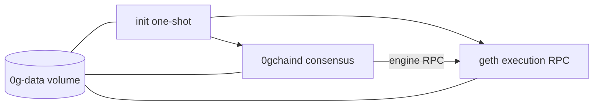

# 0G Docker

Dockerized 0G Aristotle mainnet archive RPC node for Chainlink/CCIP.

This is 0g-docker v1.0.0

## Network

| Field | Value |
| --- | --- |
| Network | 0G Aristotle mainnet |
| Chain ID | `16661` |
| Native token | `0G` |
| Public RPC | `https://evmrpc.0g.ai` |
| Explorer | `https://chainscan.0g.ai` |

The image packages both upstream 0G clients from the versioned Aristotle release archive:

- `0gchaind` consensus client
- `geth` execution client with archive config

## Architecture

Compose runs the node as separate services that share the same `0g-data` volume:



The `init` service restores an optional snapshot, prepares config, generates fresh consensus keys and JWT material, and initializes geth genesis. After that, `geth` and `0gchaind` run as independent long-lived services with separate health checks and metrics labels.

## Requirements

Recommended production host capacity:

- 16 CPU
- 64 GiB RAM
- At least 1 TiB free disk; several TiB is preferred for archive growth

The upstream archive snapshot is large. Use a host with enough free space before setting `SNAPSHOT`.
Snapshot restore downloads the compressed archive before extraction, so budget temporary disk
for the compressed archive plus the extracted data.

## Quick Start

```bash
cp default.env .env
nano .env
./0gd up
```

For local RPC access through loopback ports:

```bash
COMPOSE_FILE=0g.yml:rpc-shared.yml ./0gd up
```

For production with Traefik:

```bash
COMPOSE_FILE=0g.yml:ext-network.yml ./0gd up
```

For production with Traefik and self-updating Cloudflare A records:

```bash
COMPOSE_FILE=0g.yml:ext-network.yml:cf-ddns.yml ./0gd up
```

## Configuration

Key variables in `.env`:

| Variable | Description | Default |
| --- | --- | --- |
| `ZEROG_VERSION` | Aristotle release tag without the leading `v` | `1.0.4` |
| `SNAPSHOT` | Optional initial archive snapshot URL | empty |
| `MONIKER` | 0gchaind node moniker | `0g-node` |
| `GETH_ENGINE_HOST` | Hostname 0gchaind uses for geth engine RPC | `geth` |
| `P2P_EXTERNAL_IP` | IPv4 advertised for geth and 0gchaind P2P; empty or `auto` resolves IPv4 at startup, `none` disables advertisement | empty |
| `INIT_WAIT_TIMEOUT` | Seconds geth and 0gchaind wait for the init marker before exiting | `600` |
| `RPC_HOST` | Traefik HTTP RPC hostname prefix | `0g` |
| `WS_HOST` | Traefik WebSocket hostname prefix | `0gws` |
| `CF_DNS_API_TOKEN` | Cloudflare token used by `cf-ddns.yml` | empty |
| `CF_ZONE_ID` | Cloudflare zone ID used by `cf-ddns.yml` | empty |
| `DDNS_PROXY` | Whether Cloudflare should proxy records created by `cf-ddns.yml` | `false` |
| `DDNS_TAG` | `qmcgaw/ddns-updater` image tag | `v2` |
| `PUBLIC_RPC` | Reference endpoint used by `check-sync` | `https://evmrpc.0g.ai` |

Production inventory can leave `P2P_EXTERNAL_IP` empty when the container has outbound HTTPS to the public IPv4 lookup endpoints. Startup fails if all lookup endpoints are unreachable. Set it to a fixed IPv4 to pin the advertised address, or `none` to skip explicit advertisement. Do not use Docker service names such as `geth`; external P2P peers must receive a routable host address.

## Ports

| Variable | Service | Container Port | Purpose |
| --- | --- | ---: | --- |
| `RPC_PORT` | `geth` | `8545` | HTTP JSON-RPC |
| `WS_PORT` | `geth` | `8546` | WebSocket JSON-RPC |
| `AUTH_RPC_PORT` | `geth` | `8551` | engine auth RPC |
| `GETH_P2P_PORT` | `geth` | `30303` | P2P TCP/UDP |
| `GETH_METRICS_PORT` | `geth` | `9001` | Prometheus metrics |
| `CL_RPC_PORT` | `0gchaind` | `26657` | consensus RPC |
| `CL_P2P_PORT` | `0gchaind` | `26656` | P2P TCP |
| `CL_METRICS_PORT` | `0gchaind` | `26660` | Prometheus metrics |

Only P2P ports are published by the base compose file. Use `rpc-shared.yml` for local-only RPC/debug ports and `ext-network.yml` for Traefik. Port variables set both the container listen port and the published host port.

`cf-ddns.yml` runs `qmcgaw/ddns-updater` and maintains IPv4 Cloudflare A records for `RPC_HOST.DOMAIN` and `WS_HOST.DOMAIN`. It is intentionally IPv4-only because some production RPC hosts do not have public IPv6 connectivity.

## Commands

| Command | Description |
| --- | --- |
| `./0gd up` | Start the node |
| `./0gd down` | Stop the node |
| `./0gd restart` | Restart the node |
| `./0gd logs -f` | Follow logs |
| `./0gd logs -f geth` | Follow geth logs |
| `./0gd logs -f 0gchaind` | Follow 0gchaind logs |
| `./0gd update` | Update images and configuration |
| `./0gd check-sync` | Compare local latest block to public RPC |
| `./0gd version` | Show geth and 0gchaind versions |
| `./0gd space` | Show Docker volume usage |
| `./0gd terminate` | Stop and delete all Docker volumes |

## Sync Check

`./0gd check-sync` defaults to the running `geth` compose service and compares local geth JSON-RPC against `https://evmrpc.0g.ai`.

```bash
./0gd check-sync
./0gd check-sync --block-lag 10
./scripts/check_sync.sh --compose-service geth
./scripts/check_sync.sh --local-rpc http://127.0.0.1:8545
```

Exit codes:

- `0`: in sync
- `1`: syncing
- `2`: error

## Snapshot Restore

Set `SNAPSHOT` to a supported `.tar.lz4`, `.tar.gz`, `.tar.zst`, or `.tar` archive before first start. The `init` service downloads it with `aria2c -x 16`, extracts it into `/data`, then initializes any missing config, keys, JWT, and geth genesis state.

Snapshot extraction is guarded by `/data/.snapshot-restored`; full initialization is guarded by `/data/.initialized`.
Partial downloads are kept under `/data/.snapshot-download` so a failed restore can resume on the next `init` run. The temporary download is removed after successful extraction.

## Validation

```bash
shellcheck -x ethd scripts/check_sync.sh node/entrypoint.sh
pre-commit run --all-files
docker compose --env-file default.env -f 0g.yml config
docker compose --env-file default.env -f 0g.yml -f rpc-shared.yml config
docker compose --env-file default.env -f 0g.yml -f ext-network.yml config
docker compose --env-file default.env -f 0g.yml -f ext-network.yml -f cf-ddns.yml config
docker compose --env-file default.env -f 0g.yml run --rm --no-deps geth sh -lc 'curl -4fsS --max-time 5 https://ifconfig.me/ip'
```

Use a Linux Docker host for image smoke tests because the upstream binaries are linux/amd64.
